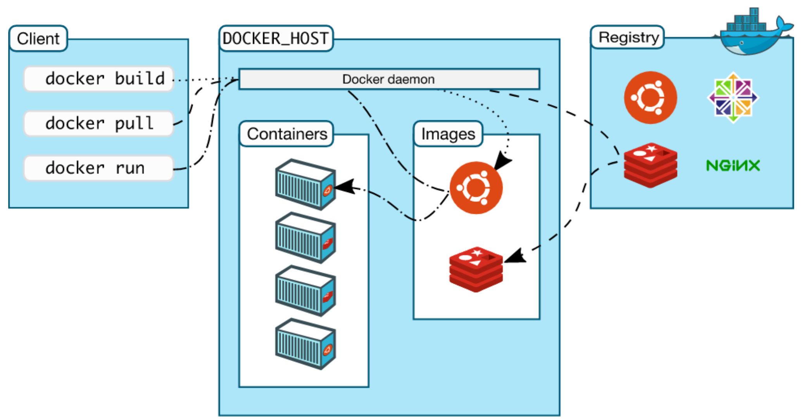

# Docker

## Базові концепції

Ви можете уявляти Docker-контейнер як процес, що працює в повній ізоляції від материнської операційної системи, з власною файловою системою, користувачем, дозволами тощо.

Docker надає інструменти:

* Створювати контейнер з набору інструкцій, використовуючи рівневу архітектуру (аналогічно рецепту для страви).
* Зберігати та отримувати образи з одного або декількох реєстрів (наприклад, Docker Hub). Образи (images) - це як напівфабрикат страви, наприклад, піци, приготований відповідно до рецепту (Docker файл).
* Запускати / зупиняти / фіксувати стан робочого контейнера. Уявімо, що ми ставимо піцу у мікрохвильову піч чи духовку. І таким чином ранимо імеджі і маємо змогу їх ізолювати та працювати з ними.

Загляньте на Docker Hub, щоб побачити багато цікавих можливостей!

<figure><figcaption></figcaption></figure>

<figure><figcaption></figcaption></figure>





